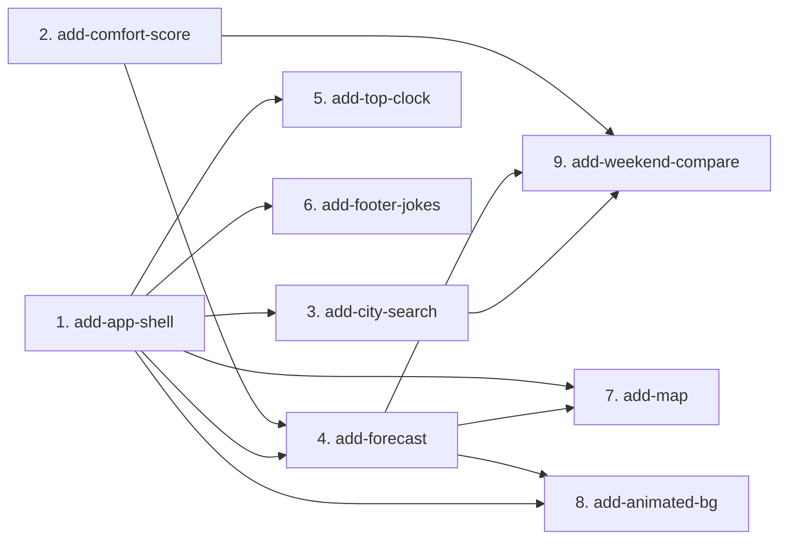

# MVP Capability Change Plan

**Phase 3 of the SDD process** — split the MVP into capability changes that the
delivery loop executes one-by-one (proposal → spec deltas → design → tasks →
tests(red) → implement(green) → review gate → archive).

> Inputs: `docs/product-brief.md`, `docs/requirements.md`, the baseline specs
> under `openspec/specs/`, and `docs/open-meteo-reference.md`.
> Stack reality: keyless, no DB, no auth, no migrations (ADR-0001). The usual
> "serialize because of DB migrations" rule does not apply here; serialization is
> driven only by **shared modules** (the app shell + active-location state).

## 1. Slicing principles

1. One slice ≈ one cohesive capability, sized to design/build/test/archive as a unit.
2. Dependency-respecting order — foundations first; no slice depends on a sibling shipping after it.
3. One owner per requirement — every MVP FR assigned to exactly one slice (no gaps, no duplicates). Cross-cutting NFRs are honored by every slice.
4. Baseline-spec aligned (one slice per baseline spec; none bundled).
5. Naming: kebab-case `add-<capability>` under `openspec/changes/`.

## 2. The capability changes

| # | Change name | Baseline spec | MVP FRs | NFRs/constraints travelling | Depends on | Parallel |
|---|---|---|---|---|---|---|
| 1 | `add-app-shell` | app-shell | FR-SHELL-01, FR-SHELL-02, FR-SHELL-03 | NFR-A11Y-01/02, NFR-PERF-03, NFR-I18N-01, BC-BRAND-01/02, BC-PRIVACY-03 | — | serialize (foundation: shell + i18n + active-location state + error-surface) |
| 2 | `add-comfort-score` | comfort-score | FR-COMFORT-01..05 | TC-PURE-01, NFR-I18N-01 | — | parallel-safe (pure `lib/scoring/` only — disjoint from #1) |
| 3 | `add-city-search` | city-search | FR-SEARCH-01..06 | NFR-A11Y-01, BC-PRIVACY-02, TC-DATA-01, NFR-COST-01 | 1 | serialize (writes active-location state; fills the shell empty-state slot) |
| 4 | `add-forecast` | forecast | FR-FORECAST-01..05 | TC-STACK-03, TC-DATA-01, NFR-OBS-01 | 1, 2 | serialize (core; reads active-location, renders score badges) |
| 5 | `add-top-clock` | top-clock | FR-CLOCK-01 | NFR-A11Y-01, NFR-OBS-01 | 1 | parallel-safe (header slot + `lib/clock`; disjoint files) |
| 6 | `add-footer-jokes` | footer-jokes | FR-JOKES-01 | BC-PRIVACY-01, NFR-I18N-01 | 1 | parallel-safe (footer slot + `lib/jokes`; disjoint files) |
| 7 | `add-map` | map | FR-MAP-01..05 | TC-STACK-04, TC-MAP-01, NFR-A11Y-01 | 1, 4 | serialize (writes active-location → triggers forecast re-fetch; shares state contract) |
| 8 | `add-animated-bg` | animated-bg | FR-ANIM-01..04 | NFR-A11Y-01 | 1, 4 | parallel-safe (own background layer + `lib/sky`; reads forecast condition/sun data, disjoint files) |
| 9 | `add-weekend-compare` | weekend-compare | FR-COMPARE-01..03 | BC-PRIVACY-03 | 2, 3, 4 | serialize (integrative: pins cities, per-city forecast + score) |

**Parallel** = `parallel-safe` (disjoint modules, no shared file → may run concurrently in a worktree) or `serialize` (touches a shared module — here the app shell or the active-location state). Default to parallel-safe only where disjointness is provable.

**Cross-cutting NFRs/constraints every change MUST honor:**
- NFR-PERF-01 (TTFB ≤ 300 ms), NFR-PERF-02 (Lighthouse Perf ≥ 90), NFR-PERF-03 (initial JS ≤ 200 KB gz) — defer heavy client libs (Leaflet, Recharts) behind `dynamic()`.
- NFR-A11Y-01/02 (Lighthouse A11y ≥ 95, visible focus + accessible names, AA contrast both themes).
- NFR-COST-01 (keyless), NFR-OBS-01 (silent console), NFR-DX-01 (battery < 60 s), NFR-I18N-01 (strings in `lib/i18n/uk.ts`).
- BC-PRIVACY-01/02/03 (no analytics/trackers, geolocation only opt-in, no cookies), BC-BRAND-01/02 (Ukrainian-first, calm, no exclamation marks; footer credits), BC-DEMO-01 (publicly demonstrable).
- TC-PURE-01 (`lib/` framework-free), TC-DATA-01 (Open-Meteo from Server Components/Route Handlers), TC-MAP-01 (OSM attribution + policy).

## 3. Dependency graph

**Critical path:** `add-app-shell` → `add-forecast` (needs `add-comfort-score`) → `add-map` / `add-animated-bg` → `add-weekend-compare`.

**Parallelizable waves** (disjoint modules, no shared file):
- **Wave 0 (no deps):** `add-app-shell` (serialize, foundation) and `add-comfort-score` (pure lib) — disjoint, may run together.
- **Wave 1 (after app-shell):** `add-top-clock`, `add-footer-jokes` — disjoint header/footer slots + own `lib/` modules; may run concurrently.
- **Wave 2:** `add-city-search` then `add-forecast` (forecast needs comfort-score for badges).
- **Wave 3 (after forecast):** `add-map` and `add-animated-bg` — disjoint (Leaflet component vs background layer); may run concurrently, re-run battery after each merge.
- **Wave 4:** `add-weekend-compare` (integrative, last).

Everything that writes the **active-location state** (search, map) or the **shell** is serialized through `add-app-shell`, which defines that contract first.

## 4. Per-change scope and exit criteria

### 4.1 `add-app-shell`
- **Scope in:** Root layout + top bar (logo, theme indicator reflecting system `prefers-color-scheme`, clock slot) + responsive main grid (mobile 1-col <768, tablet 2-col 768–1279, desktop 3-col ≥1280) + footer scaffold with Open-Meteo + OpenStreetMap credit links. The **active-location state contract** (read from URL `?lat&lon&name`, in-memory, no cookies) and the **inline error-surface pattern** (calm banner/inline state, no toast, never a 500). `lib/i18n/uk.ts` + `en.ts` + a typed string accessor. First-load empty state (hero + centered search slot) when no `lat/lon/name`; deep-link loads location directly.
- **Scope out:** the actual search input (→ add-city-search), forecast/map/clock/jokes content (slots only), theme toggle (FR-SHELL-01 = indicator only, Checkpoint 1).
- **Definition of done:** layout snaps at 768/1280 (verified in browser at 360/800/1440); empty vs deep-link state both render; i18n accessor used for every visible string; zero console output; lint+tsc+build+`openspec validate` green.
- **Risks:** the active-location state shape is a shared contract — get it right (typed `{lat:number; lon:number; name:string}` + URL sync helper in `lib/location`, pure). ADR-worthy if state approach is non-obvious.

### 4.2 `add-comfort-score`
- **Scope in:** `lib/scoring/comfort.ts` — pure, total `comfortScore(daily): { value:0..100; rationale:string }` from feels-like temp, precip probability, wind, cloud cover, UV index; Ukrainian rationale ≤ 80 chars, no emojis; band helper (green ≥70 / yellow 40–69 / red <40); weekend-average helper (Sat+Sun by location-local date). Exhaustive Vitest unit tests (edge/missing inputs, clamping, boundary 39/40/69/70, 80-char limit).
- **Scope out:** the badge UI (rendered by add-forecast), data fetching.
- **Definition of done:** 100% branch coverage on `comfort.ts`; never throws on any input; rationale always ≤80 chars & emoji-free (property-style tests); framework-free (no react/next/DOM import).
- **Risks:** scoring weights are a product decision — document the formula + weights in `design.md`; thresholds fixed (no tuning).

### 4.3 `add-city-search`
- **Scope in:** Search input (debounced ~300 ms) → Open-Meteo geocoding suggestions (name, admin1, country, flag emoji from country code); select → set active location + URL `?lat&lon&name`; Enter with single suggestion auto-selects; zero results → inline "Нічого не знайдено" (no toast); "Use my location" opt-in button (never on load; silent fallback on denial). Network failure → inline calm error + retry. `lib/geo` pure mappers (incl. country-code→flag, missing `results` handling).
- **Scope out:** reverse geocoding (none; see add-map), forecast rendering.
- **Definition of done:** debounce verified; keyboard accessible (combobox semantics, visible focus); zero-results + network-error states reachable; geolocation only on button; `lib/geo` unit-tested incl. omitted `results` key.
- **Risks:** debounce + race handling (stale responses); accessibility of the suggestions listbox.

### 4.4 `add-forecast`
- **Scope in:** Open-Meteo 7-day daily + 48h hourly fetch via a Route Handler / Server Component (`lib/weather` pure mappers + types using real field names from `docs/open-meteo-reference.md`); 7 day cards (UA weekday, hi/lo °C, weather-code icon, precip %, wind) with comfort badge; Recharts 48h hourly temp line chart (deferred via `dynamic`); today sunrise/sunset under chart; re-fetch on location change with in-memory cache of last success; fetch failure → inline calm error. Weekend comfort highlight at top of grid (uses add-comfort-score).
- **Scope out:** map, animated background, compare table.
- **Definition of done:** real Open-Meteo fetch succeeds for a known city (smoke); cards + chart + sunrise/sunset render; error state on simulated failure; `lib/weather` unit-tested (mapping, cache, weekday/weekend math local-date); Recharts not in the initial homepage bundle.
- **Risks:** chart bundle size vs NFR-PERF-03 (lazy-load); local-date correctness for weekday/sunrise (use `timezone=auto` location-local strings, never `toISOString().slice`).

### 4.5 `add-top-clock`
- **Scope in:** Compact accessible header clock, live-updating, visitor's local timezone; `lib/clock` pure time-format helper; teardown on unmount (silent console); no layout shift.
- **Scope out:** any weather/location time (that's animated-bg's sun logic).
- **Definition of done:** updates live; accessible name; interval cleared on unmount (no act warnings); `lib/clock` unit-tested.
- **Risks:** hydration mismatch (server vs client initial time) — render a stable placeholder until mounted.

### 4.6 `add-footer-jokes`
- **Scope in:** Deterministic Ukrainian weather-joke selector `lib/jokes` (curated local list, chosen by stable index e.g. day-of-year — no randomness, no API, no tracking); footer joke component; calm tone, no exclamation marks.
- **Scope out:** external joke source, analytics.
- **Definition of done:** same joke server & client (no hydration mismatch); selector pure + unit-tested (determinism, bounds); list curated & on-tone.
- **Risks:** hydration determinism — selection must not depend on `Date.now()` at render in a way that differs SSR vs client; pick by a date passed in / stable seed.

### 4.7 `add-map`
- **Scope in:** Leaflet/react-leaflet OSM map, client-only via `dynamic(() => import(...), { ssr:false })` from a `"use client"` wrapper (Next 16.2 gotcha), equal-footprint SSR skeleton; bound to active location (~z10); marker + city popup; OSM attribution bottom-right (TC-MAP-01); click → set active location (lat/lon) → forecast re-fetch. **Reverse-geocode resolution pending Checkpoint 2** (Open-Meteo has none) — see Risks.
- **Scope out:** non-OSM tiles, vector tiles, geocoded search (that's add-city-search).
- **Definition of done:** map renders client-only with skeleton placeholder (no layout shift, no SSR error); attribution visible; click updates location + forecast; Leaflet not in initial homepage bundle.
- **Risks:** **FR-MAP-03 reverse-geocode is impossible with Open-Meteo (forced reality).** Recommended resolution (Checkpoint 2): clicked points set the active location by coordinates and label the popup/URL by rounded coordinates; the baseline map spec is amended in this slice's change folder to match. Leaflet marker-icon asset path under Next bundling is a known gotcha (configure icon URLs).

### 4.8 `add-animated-bg`
- **Scope in:** Fixed background layer reflecting condition (day/night gradient + rain/snow/cloud particles from weather code); day vs night from active location's today sunrise/sunset (not visitor clock); `prefers-reduced-motion` → static gradient only; `pointer-events:none`. Pure condition→visual mapping in `lib/sky`.
- **Scope out:** audio, heavy WebGL.
- **Definition of done:** background never intercepts clicks; reduced-motion path renders static; day/night correct vs location sun times; `lib/sky` unit-tested; particle animation is CSS/light-canvas, perf-safe.
- **Risks:** performance budget (particle count) vs NFR-PERF-02; respecting reduced-motion fully.

### 4.9 `add-weekend-compare`
- **Scope in:** Pin up to 3 cities (chip row above forecast); "Compare weekend" toggle → 3-column Sat/Sun table (hi/lo, precip %, comfort score) with sticky per-city headers + "make active" button; client-only state (no cookies); empty state handled; pin limit enforced.
- **Scope out:** server persistence, accounts.
- **Definition of done:** pin/unpin works up to 3; compare table shows Sat/Sun per city using add-comfort-score; "make active" switches main view; empty + max states handled; no cookies set.
- **Risks:** N city forecast fetches (reuse add-forecast fetch + cache); table responsive/sticky behavior on mobile.

## 5. FR coverage check

| FR | Slice | FR | Slice | FR | Slice |
|---|---|---|---|---|---|
| FR-SHELL-01 | 1 | FR-SEARCH-04 | 3 | FR-MAP-02 | 7 |
| FR-SHELL-02 | 1 | FR-SEARCH-05 | 3 | FR-MAP-03 | 7 |
| FR-SHELL-03 | 1 | FR-SEARCH-06 | 3 | FR-MAP-04 | 7 |
| FR-CLOCK-01 | 5 | FR-FORECAST-01 | 4 | FR-MAP-05 | 7 |
| FR-SEARCH-01 | 3 | FR-FORECAST-02 | 4 | FR-ANIM-01 | 8 |
| FR-SEARCH-02 | 3 | FR-FORECAST-03 | 4 | FR-ANIM-02 | 8 |
| FR-SEARCH-03 | 3 | FR-FORECAST-04 | 4 | FR-ANIM-03 | 8 |
| FR-JOKES-01 | 6 | FR-FORECAST-05 | 4 | FR-ANIM-04 | 8 |
| FR-COMFORT-01 | 2 | FR-COMFORT-04 | 2 | FR-COMPARE-01 | 9 |
| FR-COMFORT-02 | 2 | FR-COMFORT-05 | 2 | FR-COMPARE-02 | 9 |
| FR-COMFORT-03 | 2 | FR-MAP-01 | 7 | FR-COMPARE-03 | 9 |

Total: **33 MVP FRs across 9 slices** (no gaps, no duplicates).

## 6. Sequencing

Implement in dependency order (waves in §3). After each archive run
`npx openspec validate --all --strict` + `node scripts/check-traceability.mjs` +
`node scripts/check-trajectory.mjs` before starting the next slice. Re-run the
full battery after merging any parallel wave. Future-Phase work: none (all 33 FRs
are MVP).
