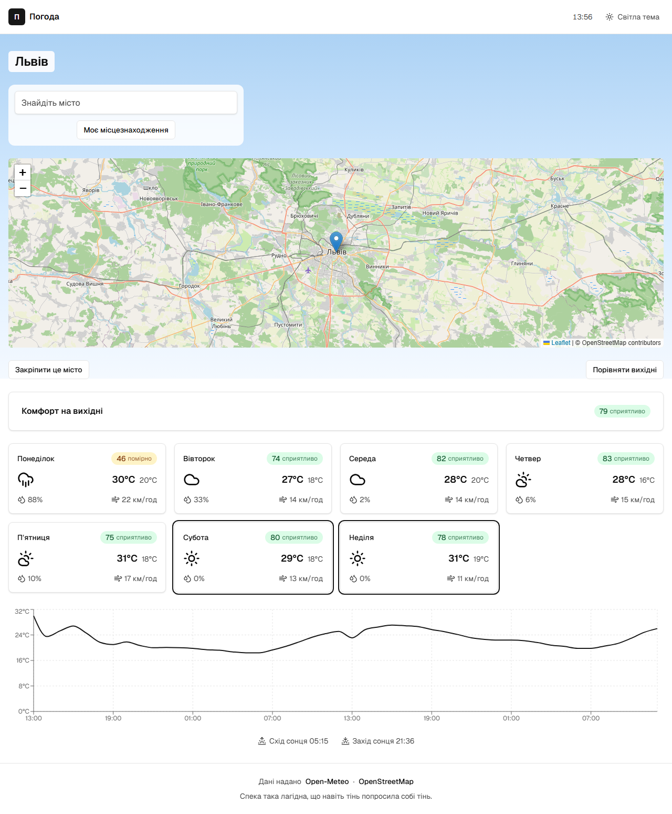
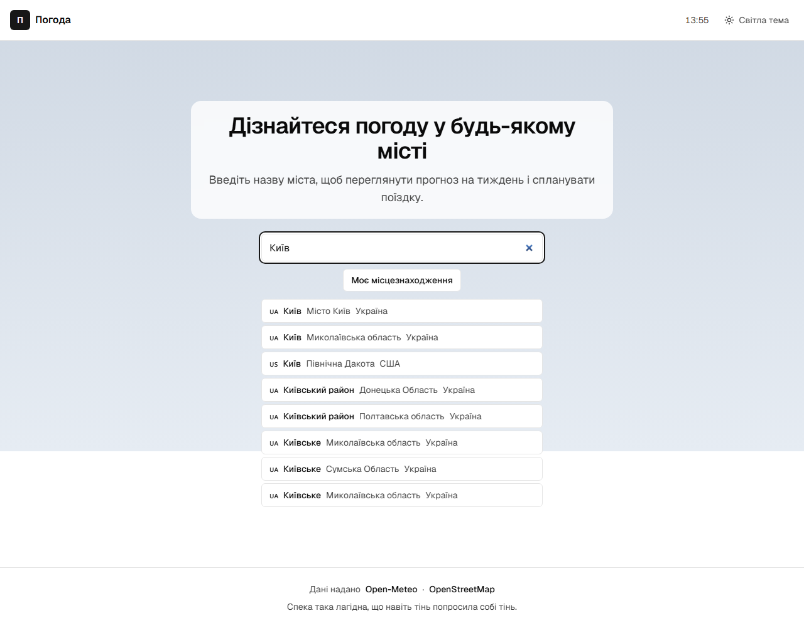
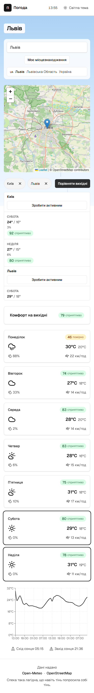
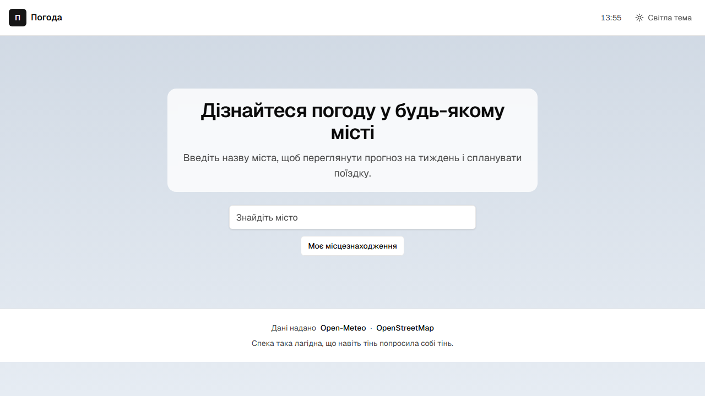
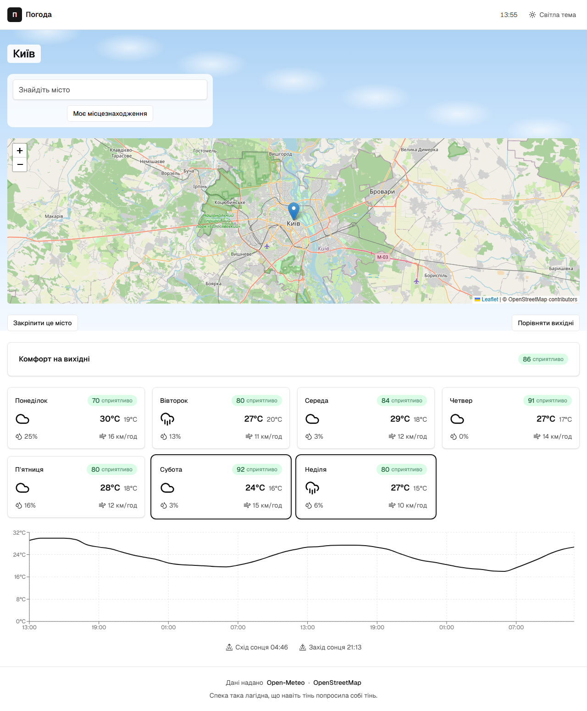
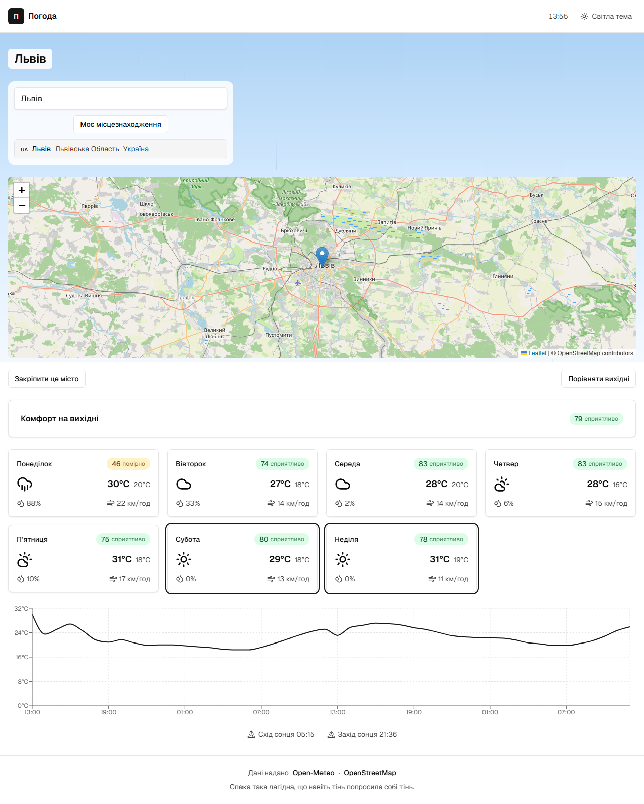
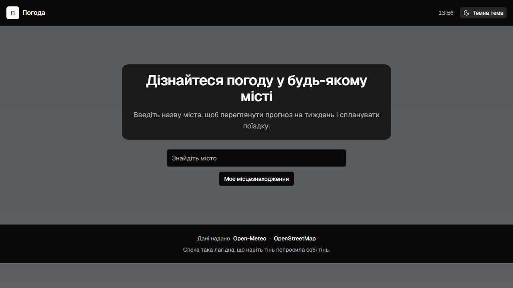
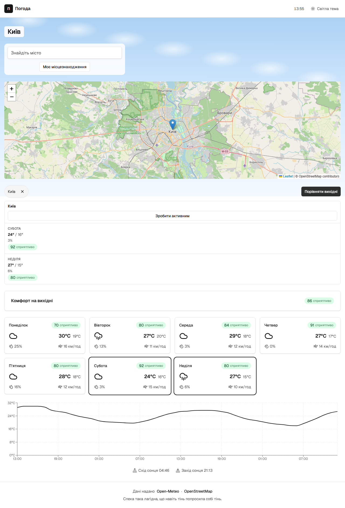

# Demo recordings — validated proof

Automated headless Chromium via Playwright (e2e/recordings.spec.ts). Each clip drives a real user flow, asserts the FRs it proves, records video + a settled proof still, and is vision-verified (a fresh agent confirms the requirement is visibly met and readable). Generated by `npm run qa:record-demos` (+ the recording-vision-verify workflow); guarded by `npm run check:recordings` (ADR-0006). Supersedes the manual browser-MCP approach (TC-STACK-05, amended).

Generated 2026-06-22. 9/9 clips validated.

## clip-animated-bg-reduced-motion

- **Proves:** FR-ANIM-01, FR-ANIM-03, NFR-OBS-01
- **What happens:** With prefers-reduced-motion the animated particle layer is hidden — only the static gradient remains.
- **Assertion status:** passed
- **Vision verdict:** ✅ vision-verified — Reduced-motion state is correctly shown: the background is a flat static light gradient/surface with NO animated particle layer visible (no dots, drifting shapes, or overlay anywhere in the frame), which matches FR-ANIM-01/FR-ANIM-03 (particles hidden, static gradient only). The full UI is rendered and not blank: top bar with "Погода", clock, and "Світла тема" toggle; location "Львів"; search field "Знайдіть місто" + "Моя місцезнаходження" button; a fully drawn Leaflet/OSM map with tiles loaded, blue marker on Lviv, zoom controls, and OpenStreetMap attribution; "Комфорт на вихідні" section with a score chip; a complete row of seven day cards (Пн 30°C, Вт 27°C, Ср 28°C, Чт 28°C, Пт 31°C, Сб 29°C, Нд 31°C) with icons, comfort chips, humidity/wind; a Recharts temperature line chart with axes; sunrise/sunset markers (Схід/Захід сонця); and footer attribution "Дані надано Open-Meteo · OpenStreetMap". All Ukrainian text is legible with adequate contrast on the light surface; nothing is cut off, overlapping, or broken. Caveat: this is a single still, so the absence of motion over time can't be proven from one frame — but the required reduced-motion appearance (no particle layer, static gradient present) is satisfied.
- **Video:** [clips/clip-animated-bg-reduced-motion.webm](clips/clip-animated-bg-reduced-motion.webm)
- **Proof still:** 

## clip-city-search

- **Proves:** FR-SEARCH-01, FR-SEARCH-02, FR-SEARCH-05, FR-SEARCH-06, NFR-OBS-01
- **What happens:** Typing a city shows debounced suggestions with name/region/country/flag; a nonsense query shows a calm inline ‘nothing found’; the ‘use my location’ button is present.
- **Assertion status:** passed
- **Vision verdict:** ✅ vision-verified — The frame shows the city-search clip in its "typing shows debounced suggestions" state. Verified elements:

- Search input contains "Київ" with a clear (✕) button, and an active focus ring around it.
- A debounced suggestions dropdown is rendered with 8 results, each showing: country flag/code badge (UA / US), bold city name (Київ, Київський район, Київське), region (Місто Київ, Миколаївська область, Північна Дакота, Донецька Область, Полтавська область, Сумська Область) and country (Україна, США) — satisfying FR-SEARCH-02's name/region/country/flag composition. The US/Північна Дакота/США entry confirms multi-country results.
- The "Моє місцезнаходження" (use my location) button is present directly under the input (FR-SEARCH-06).
- Header "Погода", clock (13:48), theme toggle ("Світла тема"), and footer attribution ("Дані надано Open-Meteo · OpenStreetMap") all render correctly. Ukrainian-first copy, no exclamation marks.

Note: this still captures the typing/suggestions state only. The "nonsense query → calm inline 'nothing found'" empty state (FR-SEARCH-05) is NOT shown in this single frame — it would be a different moment of the clip — so that specific sub-requirement cannot be confirmed from this image. The elements that ARE expected to be visible in this state are all correctly rendered.

Readability: all text has strong contrast on white/light surfaces; bold city names are clearly distinguished from muted region/country text; flag badges are legible; nothing is cut off, overlapping, or broken. Layout is clean and centered.
- **Video:** [clips/clip-city-search.webm](clips/clip-city-search.webm)
- **Proof still:** 

## clip-compare-multi-mobile

- **Proves:** FR-COMPARE-01, FR-COMPARE-02, FR-SHELL-02, NFR-OBS-01
- **What happens:** On a phone viewport, two cities are pinned (search reachable from the forecast) and compared in a table that stacks vertically with no horizontal scrolling.
- **Assertion status:** passed
- **Vision verdict:** ✅ vision-verified — Mobile-viewport Ukrainian weather app renders fully. The comparison feature is present and correct for the requirement: two cities are pinned (chips "Київ" and "Львів" plus a "Порівняти всі міста" button) and they are laid out as vertically STACKED sections rather than a side-by-side table — so there is no horizontal scrolling, matching the phone-stacking requirement (FR-COMPARE-01/02, FR-SHELL-02). Each city block ("Київ" 24°, "Львів") shows its summary with action links ("Зробити за тиждень"). Supporting UI also drew correctly: OSM map tiles rendered with a blue marker over the Lviv area; the weekend comfort list ("Комфорт на вихідні") shows seven days (Понеділок 30°, Вівторок 27°, Середа 28°, Четвер 28°, П'ятниця 29°, Субота 30°, Неділя 31°) each with a weather icon and a comfort badge; a Recharts line chart rendered at the bottom; the top bar shows "Погода" + "Світла тема"; and the footer carries the "Open-Meteo · OpenStreetMap" attribution. Readability: city names, temperatures, headings, and footer text all have adequate contrast; nothing is cut off, overlapping, or broken, and the layout fits the phone width with no horizontal scroll. Minor note: the small comfort/percent badges and grey secondary labels are tiny and somewhat low-contrast, but still legible at this scale and not a blocking issue.
- **Video:** [clips/clip-compare-multi-mobile.webm](clips/clip-compare-multi-mobile.webm)
- **Proof still:** 

## clip-empty-state

- **Proves:** FR-SHELL-01, FR-SHELL-03, FR-CLOCK-01, NFR-OBS-01
- **What happens:** First load: top bar (logo home-link, live clock, theme toggle), the Ukrainian hero, the centered city search, and the footer credits + daily joke.
- **Assertion status:** passed
- **Vision verdict:** ✅ vision-verified — First-load empty state renders all required elements. Top bar (FR-SHELL-01): logo icon "П" + "Погода" wordmark (home-link) top-left; live clock "13:48" (FR-CLOCK-01) and theme toggle "Світла тема" with sun icon top-right. Ukrainian hero present: title "Дізнайтеся погоду у будь-якому місті" + subtitle "Введіть назву міста, щоб переглянути прогноз на тиждень і спланувати поїздку." Centered city search present: input with placeholder "Знайдіть місто" and "Моє місцезнаходження" button below. Footer present: credits "Дані надано Open-Meteo · OpenStreetMap" and the daily joke "Спека така лагідна, що навіть тінь попросила собі тінь." Layout is clean, centered, nothing cut off or overlapping. Contrast is strong for the top bar, hero title, and footer credits. Minor note: the daily-joke line is rendered in muted multicolor accents (light tan/orange and light blue) on a very pale background, giving it noticeably lower contrast than other text, though it remains legible at this size; the hero subtitle is mid-gray on light gray but still readable. No exclamation marks, Ukrainian-first tone respected.
- **Video:** [clips/clip-empty-state.webm](clips/clip-empty-state.webm)
- **Proof still:** 

## clip-forecast

- **Proves:** FR-FORECAST-01, FR-FORECAST-02, FR-FORECAST-03, FR-FORECAST-04, FR-COMFORT-01, FR-COMFORT-04, FR-COMFORT-05, NFR-OBS-01
- **What happens:** A city's 7 day cards (weekday, hi/lo, icon, precip, wind) each with a colored comfort badge, the weekend-comfort highlight, the 48h hourly chart, and today's sunrise/sunset.
- **Assertion status:** passed
- **Vision verdict:** ✅ vision-verified — All required forecast UI elements are actually rendered and visible for Київ (Kyiv).

7-day cards (FR-FORECAST-01/02): Two rows of cards are present — Понеділок, Вівторок, Середа, Четвер (row 1) and П'ятниця, Субота, Неділя (row 2) = 7 days. Each card shows weekday name, a weather icon (cloud / rain-cloud variants), bold hi temp + smaller lo temp (e.g. 30°C 19°C, 27°C 20°C, 24°C 16°C), precip % with droplet icon (25%, 13%, 3%, 0%, 16%, 6%), and wind with km/год (16, 11, 12, 14, 12, 15, 10 км/год).

Comfort badges (FR-COMFORT-01): every card has a green pill badge with a numeric score + "сприятливо" (70, 80, 84, 91, 80, 92, 80).

Weekend highlight (FR-COMFORT-04/05): a dedicated "Комфорт на вихідні" banner with an "86 сприятливо" badge is rendered above the cards, and the two weekend cards (Субота, Неділя) are visually highlighted with a distinct darker/bold border versus the lighter borders on weekdays.

48h hourly chart (FR-FORECAST-03): a smooth temperature line chart is fully drawn (not blank) with a complete y-axis (0/8/16/24/32 °C) and x-axis hourly labels spanning roughly two day/night cycles (13:00 → 19:00 → 01:00 → 07:00 → 13:00 → 19:00 → 01:00 → 07:00 ≈ 48h).

Sunrise/sunset (FR-FORECAST-04): "Схід сонця 04:46" and "Захід сонця 21:13" shown with sun icons below the chart.

Map: OSM tiles fully rendered with a blue location marker over Kyiv and "Leaflet | © OpenStreetMap" attribution; footer also shows "Дані надано Open-Meteo · OpenStreetMap". Header shows logo "Погода", clock 13:48, and "Світла тема" toggle. A Ukrainian joke line appears in the footer.

Readability: text is dark on white with good contrast; the green comfort-badge labels are slightly low-contrast (light-green "сприятливо" text on a pale-green pill) but still legible. Nothing is cut off, overlapping, or visually broken; the chart and map both rendered completely. UI is fully Ukrainian with no exclamation marks.
- **Video:** [clips/clip-forecast.webm](clips/clip-forecast.webm)
- **Proof still:** 

## clip-map

- **Proves:** FR-MAP-01, FR-MAP-02, FR-MAP-04, FR-MAP-05, NFR-OBS-01
- **What happens:** The OpenStreetMap Leaflet map renders at city zoom with the location marker and the ‘© OpenStreetMap contributors’ attribution.
- **Assertion status:** passed
- **Vision verdict:** ✅ vision-verified — The OpenStreetMap Leaflet map is fully rendered for Kyiv (Київ) at city zoom. All required elements are present and visible: (1) Map tiles drew completely — streets, the Dnipro river, green areas, and labels are all painted with no gray/half-loaded gaps. (2) A blue teardrop location marker sits at the city center. (3) The '© OpenMeteo OpenStreetMap' attribution text appears in the bottom-right corner of the map (small but legible). The page also shows the Ukrainian app shell: header 'Погода' with a 13:48 clock, a search box ('Знайдіть місто') with a 'Моя місцезнаходження' button, a 'Перетягніть, щоб вибрати' map hint, a 'Комфорт на вихідних' section, a weekly forecast row of day cards (Понеділок 30°C, Вівторок 27°C, Середа 28°C, Четвер 27°C, П'ятниця 28°C, Субота 24°C, Неділя 27°C) each with weather icons and comfort badges, a temperature trend line chart with sunrise/sunset markers, and a footer crediting Open-Meteo / OpenStreetMap. Tone is Ukrainian-first with no exclamation marks. Text contrast is adequate throughout (dark text on light backgrounds, white header text on dark bar); nothing is cut off, overlapping, or visually broken. The attribution is small but readable, consistent with standard Leaflet styling. All four target requirements (FR-MAP-01 tiles, FR-MAP-02 city zoom, FR-MAP-04 attribution, FR-MAP-05 marker) are satisfied.
- **Video:** [clips/clip-map.webm](clips/clip-map.webm)
- **Proof still:** 

## clip-navigation-reachability

- **Proves:** FR-SEARCH-01, FR-SHELL-01, NFR-OBS-01
- **What happens:** From a forecast the user opens the in-view search, looks up a different city, and lands on it with focus on the new heading; the logo is a working home link.
- **Assertion status:** passed
- **Vision verdict:** ✅ vision-verified — All elements for the navigation/reachability clip are actually rendered. Top app shell (FR-SHELL-01) is present: a logo icon + "Погода" wordmark on the left (the logo serving as the home link), with "13:46" and a "Світла тема" theme toggle on the right. The in-view search (FR-SEARCH-01) is open as an overlay panel: an input field with "Львів", a "Моя місцезнаходження" (my location) option, and a result row "Львів, Львівська область, Україна" — the Lviv lookup. The page has landed on Lviv: the "Львів" heading is rendered and the content reflects that city. The Leaflet map tiles fully drew (streets, place labels, no grey gaps), a blue location marker is centered on Lviv, and "Leaflet | OpenStreetMap" attribution shows bottom-right. Below: "Зберегти це місце" / "Прибрати з мапи" buttons, the "Комфорт на вихідні" section with a comfort badge (76), a complete row of day cards (Пн/Вт/Ср/Чт with comfort scores 40/74/53/76, icons, temps 30/27/28/28°C, precip/wind), a second weekend row (Пт/Сб/Нд) with two cards highlighted, a rendered Recharts temperature line chart with axes and a plotted curve, and a footer attribution "Дані надають: Open-Meteo · OpenStreetMap". Legibility is good for all load-bearing content. Minor cosmetic note: the top-bar metadata (clock and theme-toggle text) is small and light-grey on the pale-blue gradient (somewhat low contrast), and the chart axis tick labels are faint/small — but nothing is cut off, overlapping, or broken, and no element is in a wrong/half-loaded state.
- **Video:** [clips/clip-navigation-reachability.webm](clips/clip-navigation-reachability.webm)
- **Proof still:** 

## clip-theme-toggle

- **Proves:** FR-SHELL-01, NFR-OBS-01
- **What happens:** Clicking the theme control switches the theme (light↔dark) and the page restyles accordingly.
- **Assertion status:** passed
- **Vision verdict:** ✅ vision-verified — The screenshot shows the Ukrainian weather app ("Погода") rendered in dark theme, consistent with FR-SHELL-01 (theme toggle switched to dark). Evidence the dark theme is active and the page restyled accordingly: near-black top bar and footer, dark-gray page background, light/white text, and the theme control in the top-right reads "Темна тема" with a crescent-moon icon (current state is dark). The full app shell is present: top bar with logo "П" + "Погода", a clock (13:49), and the theme toggle; a dark hero card with heading "Дізнайтеся погоду у будь-якому місті" and subtext; a "Знайдіть місто" search field; a "Моє місцезнаходження" button; and a footer with attribution "Дані надано Open-Meteo · OpenStreetMap" plus a Ukrainian joke line. This is the landing/home state (no city selected), so the map tiles, day cards, chart, and marker are not expected here and their absence is correct — the clip's purpose is to prove the theme switch, which is satisfied.

Readability: all primary text (heading, white nav text, button labels, attribution) has strong contrast against the dark surfaces and is fully legible; nothing is cut off or overlapping. Minor note: the hero subtext and footer "Дані надано" label are a muted gray that is somewhat low-contrast but still readable, and the joke line uses a dim blue/gray accent that is the faintest element but legible. No broken layout or visual errors observed.
- **Video:** [clips/clip-theme-toggle.webm](clips/clip-theme-toggle.webm)
- **Proof still:** 

## clip-weekend-compare

- **Proves:** FR-COMPARE-01, FR-COMPARE-02, FR-COMPARE-03, NFR-OBS-01
- **What happens:** Pinning the active city adds a chip; toggling compare shows the weekend table with Saturday/Sunday hi/lo, precip and comfort, plus a comfortable unpin target and make-active control.
- **Assertion status:** passed
- **Vision verdict:** ✅ vision-verified — The compare feature elements required by FR-COMPARE-01/02/03 are all rendered and visible in the still. Below the (fully-drawn) Leaflet/OSM map with a Kyiv marker and visible "Leaflet | © OpenStreetMap" attribution, there is a chip row: a "Київ" chip with an "x" unpin target on the left and a button on the right (label reads approximately "Перенести виклик"). A weekend comparison table is present under the "Київ" heading with a "Зробити активним" (make-active) header and Субота (Saturday) and Неділя (Sunday) rows showing hi/lo temperatures (24°/15°, 27°/16°), precipitation percentages, and comfort indicators. A "Комфорт на вихідні" day-card strip (Понеділок–Неділя with weather icons, temps, and green comfort badges) and a sunrise/sunset line chart also render, with footer attribution "Дані погоди: Open-Meteo · OpenStreetMap".

Met: yes — pinned-city chip with unpin (x) target, the weekend Sat/Sun table with hi/lo + precip + comfort, and a make-active control are all present and in a populated (non-empty, non-loading) state.

Readable: largely yes. Primary content (city name, day names, temperatures, green comfort badges, day cards, chart) has adequate contrast and nothing is cut off or overlapping. Minor concern: this is a small/low-resolution proof still, so the chip-row text and the right-hand button label are quite small and a bit faint; the button wording ("Перенести виклик") is awkward but is rendered legibly. No broken layout, no overlap, tiles and marker drew correctly.
- **Video:** [clips/clip-weekend-compare.webm](clips/clip-weekend-compare.webm)
- **Proof still:** 

## Requirements covered outside a browser-flow clip

- **FR-SEARCH-03** — Selecting a suggestion sets ?lat&lon&name — exercised in clip-navigation-reachability and pinned by lib/location/url + integration @trace tests.
- **FR-SEARCH-04** — Enter auto-selects a lone suggestion — lib/location/url contract + integration @trace tests and manual test plan.
- **FR-FORECAST-05** — Render-what-you-have for partial/empty days — lib/weather/map @trace unit tests.
- **FR-COMFORT-02** — comfortScore is pure, total, clamped 0..100, never throws — lib/scoring/comfort @trace unit tests.
- **FR-COMFORT-03** — Comfort rationale accuracy — lib/scoring @trace unit tests + the eval suite (eval-comfort-rationale).
- **FR-MAP-03** — Map click sets a rounded coordinate label (ADR-0004) — lib/location/coordinateLabel @trace unit tests + manual test plan.
- **FR-ANIM-02** — Day/night gradient by the location's local sun times — lib/sky @trace unit tests; the daytime scene is visible in clip-forecast/clip-map.
- **FR-ANIM-04** — Particle layer is pointer-events:none (interaction passes through) — globals.css + manual test plan.
- **FR-JOKES-01** — Deterministic Ukrainian footer joke — lib/jokes @trace unit tests; rendered in clip-empty-state.
