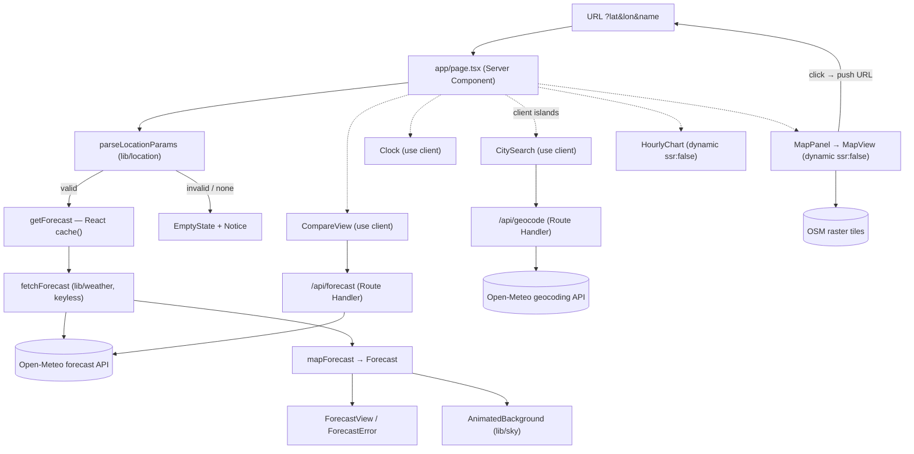

# Architecture

System overview for Weather Explorer / Weekend Trip Planner. Companion pages:
[data-model](./data-model.md) · [integrations](./integrations.md) ·
[testing](./testing.md) · [operations](./operations.md). Decisions:
[ADR-0001 stack](../adr/ADR-0001-stack.md),
[ADR-0004 map-click label](../adr/ADR-0004-map-click-coordinate-label.md).

## Shape of the system

A single-page Next.js 16.2 App Router app (React 19.2, TypeScript strict,
TC-STACK-01). It is **keyless, DB-free, auth-free, email-free, cookie-free**
([ADR-0001](../adr/ADR-0001-stack.md); NFR-COST-01, BC-PRIVACY-01/02/03). All
weather and geo data comes from the keyless Open-Meteo forecast + geocoding APIs
([integrations](./integrations.md)); maps use OpenStreetMap raster tiles. There
is no persistence layer: **the URL (`?lat&lon&name`) is the only persisted
state** (see [data-model](./data-model.md)).

Three layers:

1. **`lib/` — framework-free domain logic (TC-PURE-01).** No `next/*`, no
   `react`, no DOM globals. Pure, total, 100% unit-testable: scoring, weather/geo
   mappers, sky scenes, clock/joke helpers, pins, URL contract, i18n. Fetch
   wrappers (`lib/weather/fetchForecast.ts`, `lib/geo`) may use the `fetch`
   global but import no framework.
2. **`app/` — routes & server composition.** The home Server Component
   (`app/page.tsx`), the root layout (`app/layout.tsx`), and two keyless
   Open-Meteo proxy Route Handlers (`app/api/geocode`, `app/api/forecast`,
   TC-DATA-01).
3. **`components/` — UI.** Server Components by default; `"use client"` only for
   interactivity/browser APIs (the client islands below).

## Request flow (deep link → render)

`GET /?lat=50.45&lon=30.52&name=Київ` →

1. `app/page.tsx` (Server Component) awaits `searchParams` (a Promise in Next 16),
   reduces multi-values to first-string, and calls
   `parseLocationParams` (`lib/location/url.ts`) → `ActiveLocation` or a parse
   failure.
2. On a valid location, `getForecast(lat, lon)`
   (`components/forecast/getForecast.ts`, wrapped in React `cache()` — request-
   scoped memo, FR-FORECAST-05) calls `fetchForecast` (`lib/weather`), which
   builds the keyless Open-Meteo URL, fetches server-side (TC-DATA-01), and runs
   `mapForecast` → the domain `Forecast` (or a typed `{ ok:false }` failure that
   never throws).
3. The page renders the city `<h1>`, the map panel, the compare view, and either
   `ForecastView` (day cards + hourly chart + sun times) or the calm inline
   `ForecastError`. Today's weather code + sun times + the location-local "now"
   (`localNow`) feed `AnimatedBackground` (FR-ANIM-01/02).
4. No params → empty state (hero + centered `CitySearch`). Present-but-invalid
   params → empty state + an inline `Notice` (never a 500 or blank).

The client islands re-fetch through the Route Handlers as the user interacts:
`CitySearch` debounces calls to `/api/geocode`; `CompareView` fetches
`/api/forecast` once per pinned city; a map click pushes a new `?lat&lon&name`
URL, which re-runs the Server Component.

## Static vs dynamic context split

- **Server-rendered, no client cost:** the shell chrome, day cards, sun times,
  comfort badges, footer jokes — all Server Components. The forecast fetch + map
  is server-side (TC-DATA-01), so the Open-Meteo URL never enters the client
  bundle and no key-like parameter is ever exposed.
- **Client islands (`"use client"`):** `CitySearch` (debounced input, geolocation
  opt-in), `Clock` (live, hydration-safe `useSyncExternalStore`), `CompareView`
  (pin state, per-city fetch), and two heavy libraries deferred via
  `dynamic(..., { ssr:false })`: `MapPanel`→`MapView` (Leaflet, reaches for
  `window`) and `HourlyChartLazy`→`HourlyChart` (Recharts). Both keep their
  library out of the initial/empty-state bundle (NFR-PERF-03) and show an
  equal-footprint skeleton to avoid layout shift (FR-MAP-05).

  > Next 16.2 gotcha: `dynamic({ ssr:false })` is only allowed inside a Client
  > Component. The lazy wrappers are thin `"use client"` boundaries; importing
  > them from a Server Component would crash the build.

## Build output

`next build` produces one dynamic route `/` (server-rendered on demand), the two
dynamic `/api/*` route handlers, and a static `/_not-found` (see the build log in
[automated-verification-latest](../qa/automated-verification-latest.md)). No
database client, no auth middleware, no env vars required at runtime
([operations](./operations.md)).
